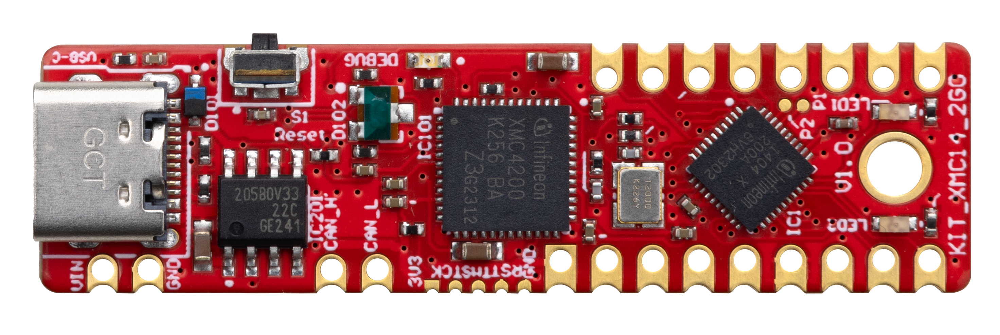

# KIT_XMC14_2GO BSP

## Overview

The XMC1400 2GO Kit (CPU-14A-V1) houses the XMC1400 Microcontroller.     
**Note:**
Programming this kit requires installing 
[SEGGER J-Link software](https://www.segger.com/downloads/jlink/#J-LinkSoftwareAndDocumentationPack)

To use code from the BSP, simply include a reference to `cybsp.h`.

## Features

### Kit Features:

* XMC1400 (ARM® Cortex®-M0 based) Microcontroller in a VQFN40 package
* On board Debugger for downloading and debugging of application code
* Virtual COM port for UART communication with terminal program e.g. Hyperterminal
* 2 User LEDs connected to GPIO P0.6, P0.7
* CAN interface with CAN transceiver mounted
* External crystal 20 MHz and 32.768 kHz mounted

### Kit Contents:

* KIT_XMC14_2GO evaluation board

## BSP Configuration

The BSP has a few hooks that allow its behavior to be configured. Some of these items are enabled by default while others must be explicitly enabled. Items enabled by default are specified in the KIT_XMC14_2GO.mk file. The items that are enabled can be changed by creating a custom BSP or by editing the application makefile.

Components:
* Device specific category reference (e.g.: CAT1) - This component, enabled by default, pulls in any device specific code for this board.

Defines:
* CYBSP_WIFI_CAPABLE - This define, disabled by default, causes the BSP to initialize the interface to an onboard wireless chip if it has one.
* CY_USING_HAL - This define, enabled by default, specifies that the HAL is intended to be used by the application. This will cause the BSP to include the applicable header file and to initialize the system level drivers.
* CYBSP_CUSTOM_SYSCLK_PM_CALLBACK - This define, disabled by default, causes the BSP to skip registering its default SysClk Power Management callback, if any, and instead to invoke the application-defined function `cybsp_register_custom_sysclk_pm_callback` to register an application-specific callback.

See the [BSP Setttings][settings] for additional board specific configuration settings.

## API Reference Manual

The KIT_XMC14_2GO Board Support Package provides a set of APIs to configure, initialize and use the board resources.

See the [BSP API Reference Manual][api] for the complete list of the provided interfaces.

## More information
* [KIT_XMC14_2GO BSP API Reference Manual][api]
* [KIT_XMC14_2GO Documentation](https://www.infineon.com/cms/en/product/microcontroller/32-bit-industrial-microcontroller-based-on-arm-cortex-m/32-bit-xmc1000-industrial-microcontroller-arm-cortex-m0/xmc1404-q040x0200-aa/)
* [Cypress Semiconductor, an Infineon Technologies Company](http://www.cypress.com)
* [Infineon GitHub](https://github.com/infineon)
* [ModusToolbox™](https://www.cypress.com/products/modustoolbox-software-environment)

[api]: https://infineon.github.io/TARGET_KIT_XMC14_2GO/html/modules.html
[settings]: https://infineon.github.io/TARGET_KIT_XMC14_2GO/html/md_bsp_settings.html

---
© Cypress Semiconductor Corporation (an Infineon company) or an affiliate of Cypress Semiconductor Corporation, 2019-2024.